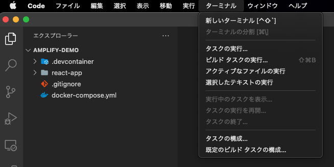
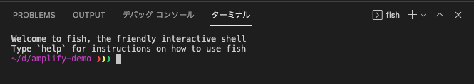
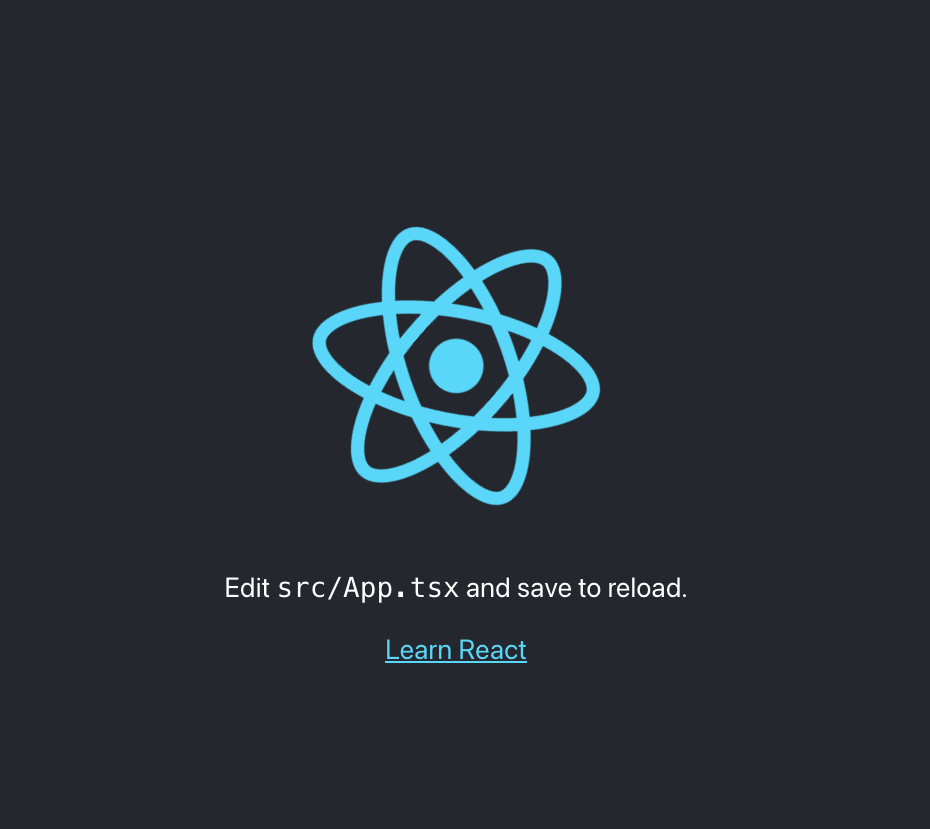

# 1. 環境作成

## 1.1. はじめに

Dockerで作成していきます。プログラム変更時のエディタはVS Codeを使用していますが，ご自身が使いたいエディタで問題ありません。

## 1.2. 作業リポジトリのclone

作業用ディレクトリとなるプログラムをcloneします。
clone先はdockerコマンドが動作するご自身の環境に合わせてください。

```sh
git clone https://github.com/Tanabebe/amplify-demo.git && cd amplify-demo
```

cloneしたらVS Codeで上記のフォルダを開きます。開いたら下図のように「ターミナル」→「新しいターミナル」を選択し，ペイン上に表示させます。




※デフォルトシェルは環境によって違うのですが，`bash`や`zsh`などdockerコマンドが通るシェルであれば問題ないです。

## 1.3. Dockerの起動

以下のコマンドを実行して，コンテナを起動します。`Creating amplify-demo_amplify_1 ... done`とターミナルに表示されればOKです。

```sh
docker-compose up -d
```

※PC性能，回線状況により異なりますが，大体5分程度でした。

起動出来たら念の為，コンテナ名と起動状態の確認を行います。以下の例だと`amplify-demo_amplify_1`がコンテナ名です。

```sh
docker-compose ps
```

以下のように，**Name**と表示されている箇所がコンテナ名です。

```
         Name                     Command            State                       Ports                     
-----------------------------------------------------------------------------------------------------------
amplify-demo_amplify_1   docker-entrypoint.sh node   Up      0.0.0.0:3000->3000/tcp, 0.0.0.0:3001->3001/tcp
```

コンテナ起動は問題ないですが，コンテナ側の`node_modules`はホスト側にマウントしていないため，以降のプログラム修正時に都合が悪いです。無理やり感はありますが，手動でコピーします。

```csharp
# docker cp コンテナ名:/amplify-demo/react-app/node_modules react-app/
docker cp amplify-demo_amplify_1:/amplify-demo/react-app/node_modules react-app/
```

コピーが終わったらコンテナの中に入っていきます。

```csharp
# docker exec -it {コンテナ名} bash 
docker exec -it amplify-demo_amplify_1 bash
```

## 1.4. 事前準備の最終確認

コンテナの中に入ったら念の為，`node`と`npm`のバージョン，`amplify`がインストールされているか確認します。

```sh
node -v && npm -v && amplify --version
```

下記のように表示されたらOKです。

```sh
v14.16.1
6.14.12
Initializing new Amplify CLI version...
Done initializing new version.
Scanning for plugins...
Plugin scan successful
4.50.2
```

最後にReactアプリが動作するか確認します。

```sh
yarn start
```

以下のようにコンソールに表示されたら`http://localhost:3000`にアクセスしましょう。

```csharp
Compiled successfully!

You can now view react-app in the browser.

  Local:            http://localhost:3000
  On Your Network:  http://172.22.0.2:3000

Note that the development build is not optimized.
To create a production build, use yarn build.
```

アクセスしたら下図の画面が表示されたらOKです。ターミナル上で`ctrl + c`でサーバーを一旦停止させます。




次はGitHubへリポジトリを作成し，コンテナの中に入ったまま起動確認したReactアプリをあげていきます。