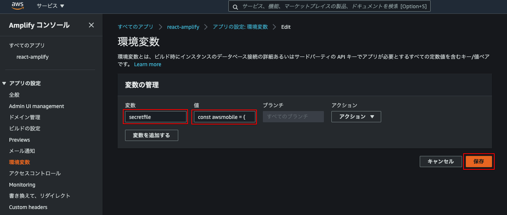
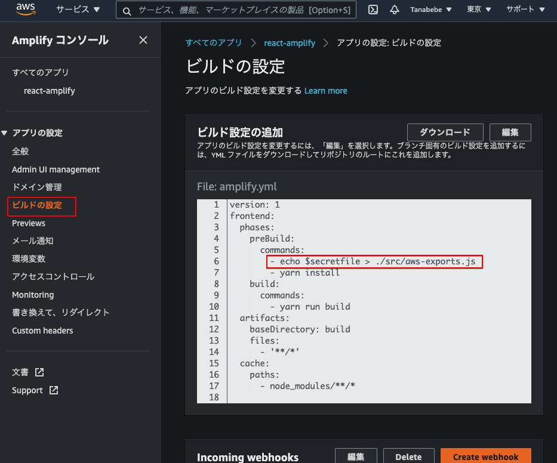
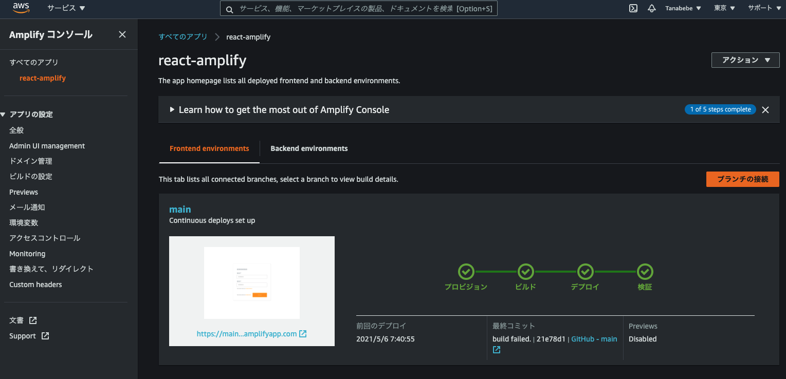
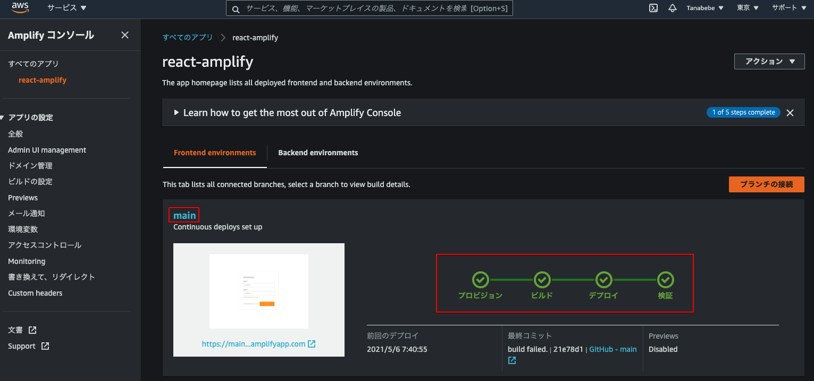
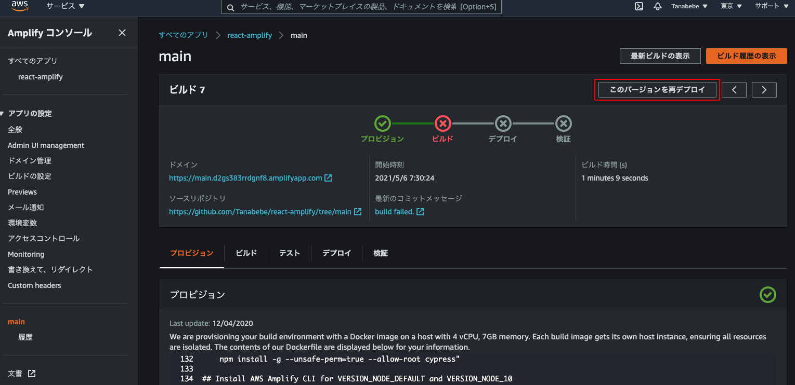

# 10. 自動デプロイ(CI)の設定を変更

実は`.gitignore`に`aws-exports.js`が含まれてしまっているため，このままだとフロントエンドのビルドで**aws-exports.jsファイルが見つからない**というエラーが発生します。<br>試しに前項からGitへプッシュするとデプロイで失敗となります（試しても試さなくても構いません）。<br>これを解決するためにAmplifyの環境変数とビルド設定を更新します。<br>
まずは環境変数を設定します。

以下のように`aws-exports.js`に書いてあるプログラムをコピーします。こちらが環境変数の値となります。変数名は`secretfile`としています。



次はビルド設定を更新します。下図のとおりビルド設定に一行追加します。AWSコンソール上で修正してOKです。



プログラム上は以下となります。

```yml
version: 1
frontend:
  phases:
    preBuild:
      commands:
        # 追加
        - echo $secretfile > ./src/aws-exports.js
        - yarn install
    build:
      commands:
        - yarn run build
  artifacts:
    baseDirectory: build
    files:
      - '**/*'
  cache:
    paths:
      - node_modules/**/*
```

では変更したコードをプッシュします。

```
$ git add .
# コメントはお好きなように
$ git commit -m "modified amplify auth add."
$ git push
```

しばらくすると自動デプロイが正常に完了することが確認出来ます。



もし，デプロイ時の試している方は以下からGitプッシュを行わなくても再デプロイが可能です。赤枠部はリンクになっているので飛んだ先で手動での再デプロイが可能です。





ここまでで完了です。お疲れ様でした。<br>とはいえ今のままでは若干見た目も微妙なので，まだ時間に余力があれば次項を進めてください。