# 10. ハンズオン環境削除

使用したAmplifyアプリの削除とIAMユーザーの削除，そしてコンテナとイメージの削除を行います．

## 10.1. Amplify上のアプリを削除

AWSコンソール上からすべてのアプリを表示し，削除するアプリを選択します。まずは`reactamplify（下図左側）`を削除します。こちらは`amplify add auth`で追加したアプリになります。

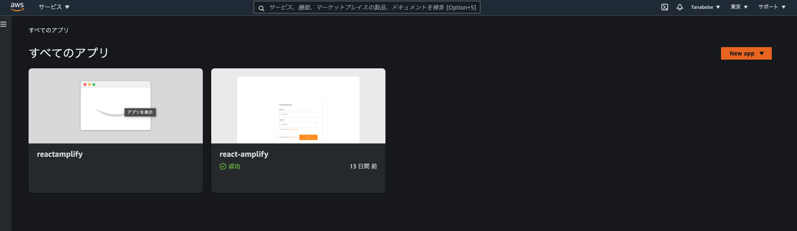

画面右上のアクションから**アプリの削除**を押します。

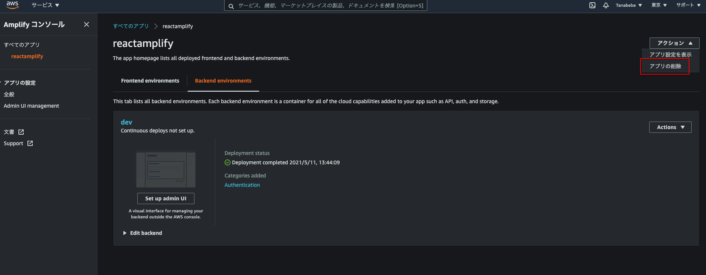

テキストボックスに**delete**を入力し，**Delete**ボタンを押します。実際に削除されるまでは少々時間がかかりますが，これで認証用に作成した`auth`のアプリは削除されます。

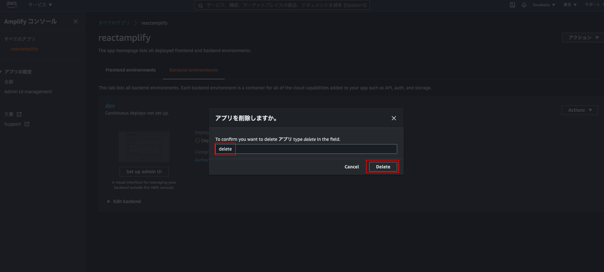

次はReactで作成した`react-amplify`アプリ（下図右側）の削除を行います。


こちらも画面右上のアクションから**アプリの削除**を押します。

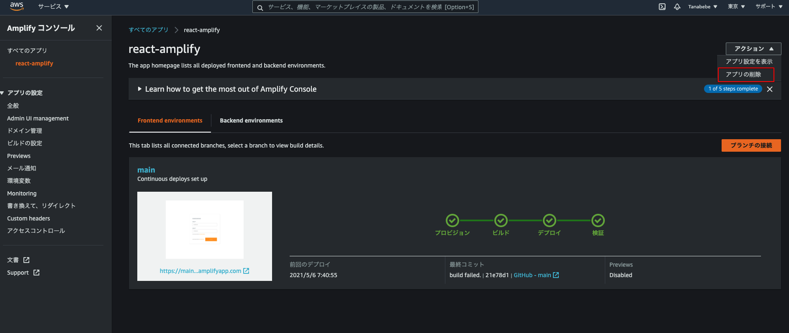

同じくテキストボックスに**delete**を入力し，**Delete**ボタンを押します。こちらはすぐ削除されます。


## 10.2. CognitoのIDプール削除

検索ボックスに**cognito**を入力し，Cognitoのサービスへ飛びます。
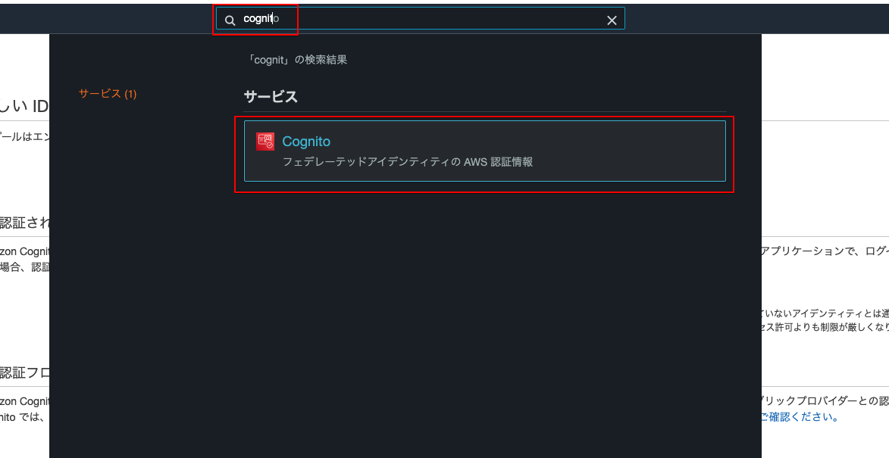

**IDプールの管理**ボタンを押します。

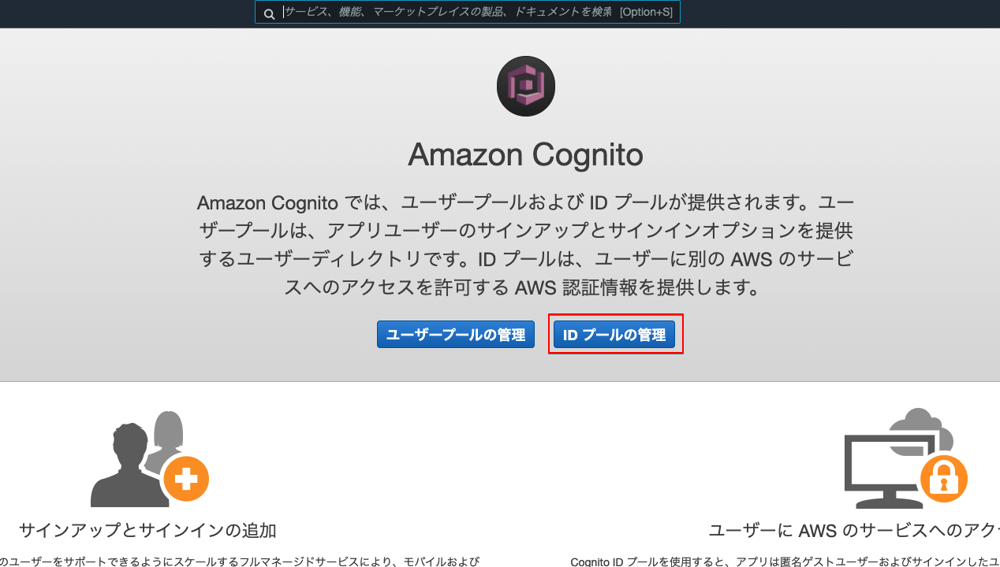

Amplifyで作成したアプリと対応したIDプールがあるので選択します。

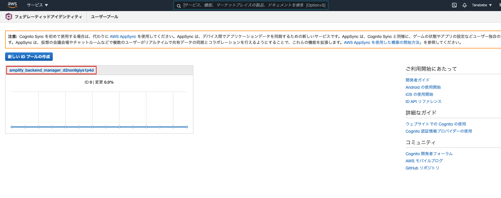

画面右上の**IDプールの編集**リンクを押します。

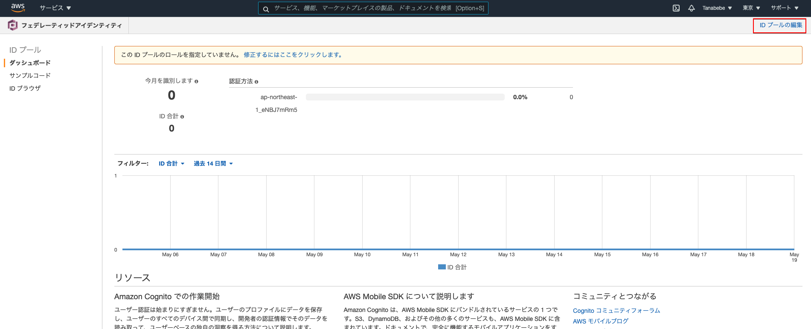

飛んだ先の画面下部に**IDプールの削除**ボタンがあるので押します。

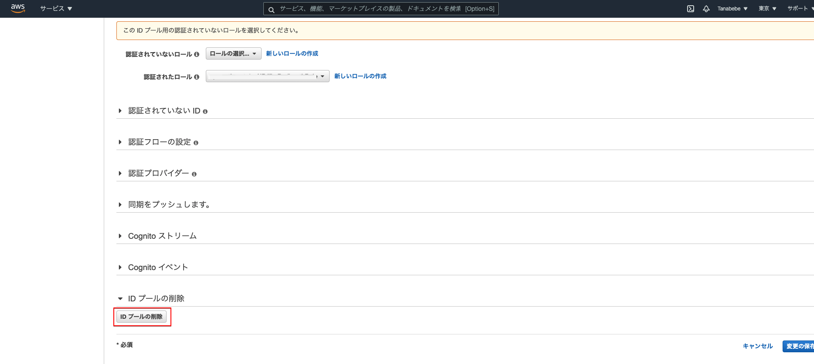

**プールの削除**を押し，IDプールの削除は完了です。
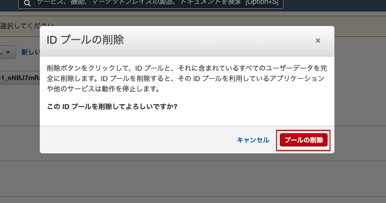

## 10.3. Cognitoのユーザープール削除

再び検索ボックスに**cognito**を入力し，Cognitoのサービスへ飛びます。


**ユーザープールの管理**ボタンを押します。

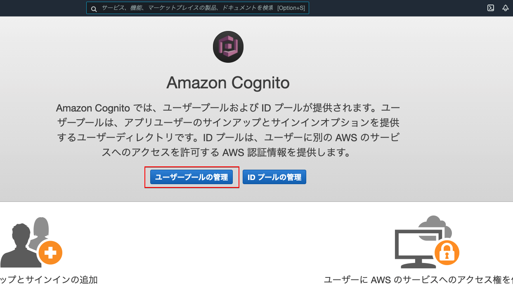

Amplifyで作成したアプリと対応したユーザープールがあるので選択します。

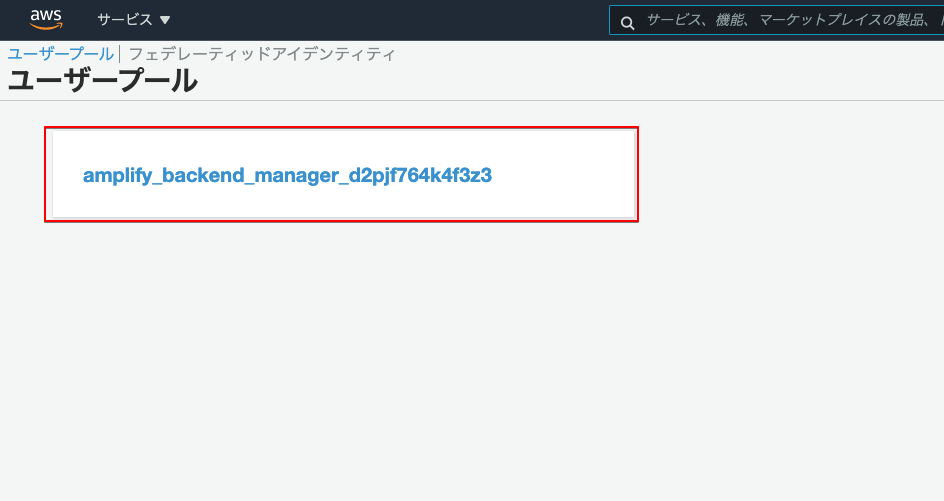

飛んだ先の画面右上に**プールの削除**リンクがあるので押します。

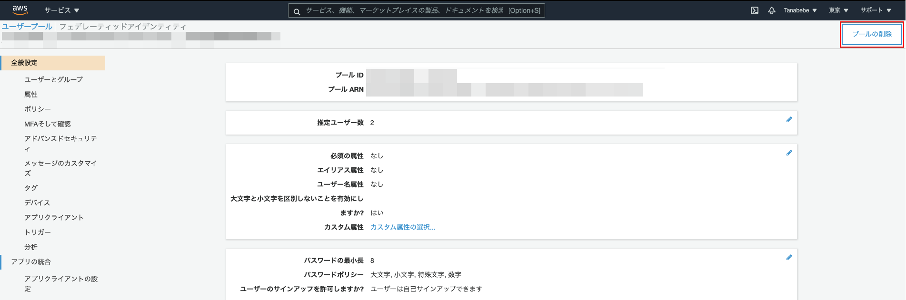

テキストボックスに**delete**と入力し，**プールの削除**ボタンを押して完了です。

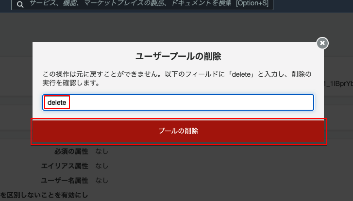

## 10.4. IAMユーザーの削除

amplify用に作成したユーザーを削除していきます。検索ボックスに**IAM**と入力し，**ユーザー**を選択してください。

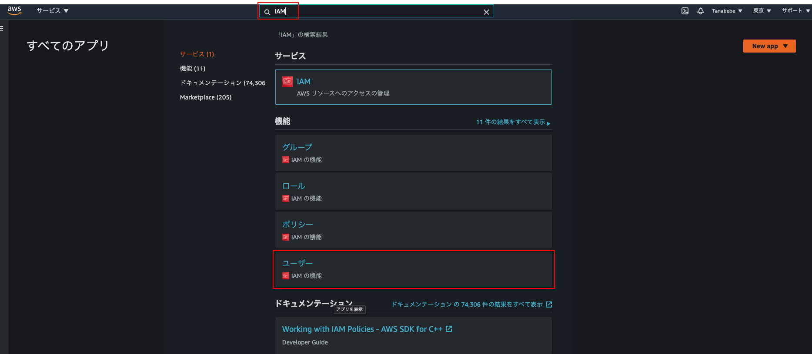

削除するユーザーの**チェックボックスをON**にし，**ユーザーの削除**ボタンを押します。

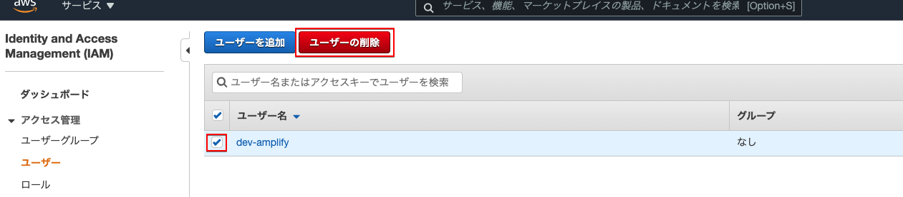

**チェックボックスをONにし**，**はい，削除します**ボタンを押します。
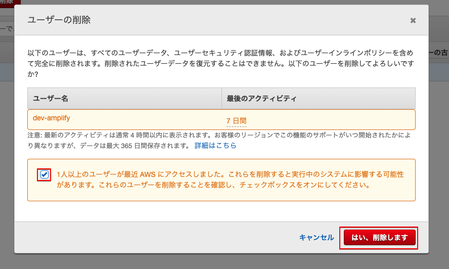

AWSコンソールの作業はこれで完了です。次は使用したコンテナとイメージを削除します。

## 10.5. Dockerコンテナの削除

VS Codeのターミナル，もしくはご自身が使用しているターミナルで以下コマンドを実行し，稼働中のコンテナを停止します。停止に完了すると停止したコンテナIDがターミナルに表示されます。

```bash
docker stop $(docker ps -q)
```

念の為，停止している全コンテナを確認します。

```bash
docker ps -a
```

下図のようにターミナル上に表示されるので，コンテナIDもしくはコンテナ名をコピーして下さい。

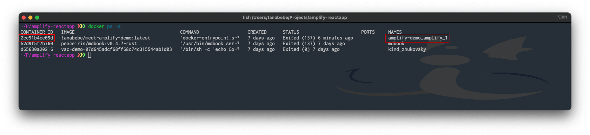

以下コマンドを実行します。

```bash
# docker rm コンテナIDもしくはコンテナ名
docker rm amplify-demo_amplify_1
```

コンテナを確認し，消えていればコンテナの削除は完了です。次はイメージを削除します。

```bash
docker ps -a
```

## 10.6. Dockerイメージの削除

ローカルに保存されているイメージの確認をするので以下コマンドを実行してください。

```bash
docker images
```

下図のようにリポジトリ部は`tanabebe/meet-amplify-demo`となっているのでイメージIDをコピーします。

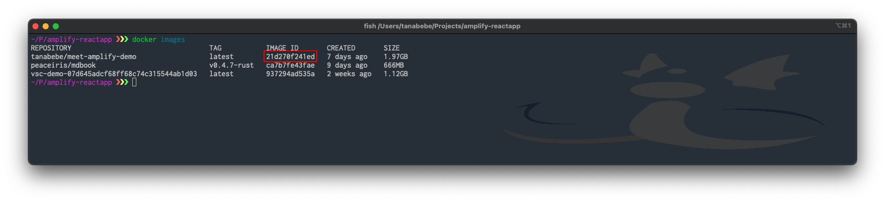

コピーしたイメージIDを使用してイメージの削除コマンドを実行します。

```bash
# docker rmi イメージID
docker rmi 21d270f241ed
```

※もし消えない場合は`docker rmi -f 21d270f241ed`のように，強制的に削除する`-f`のオプションを使用してください。

最後にイメージが消えているか確認し，完了です。

```bash
docker images
```

お疲れ様でした。