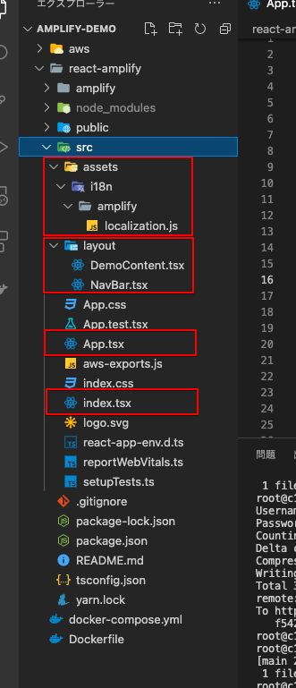
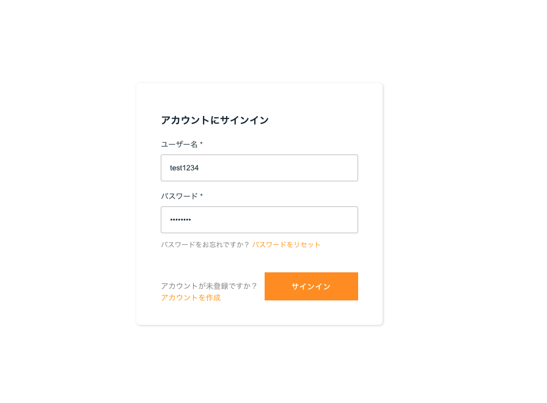
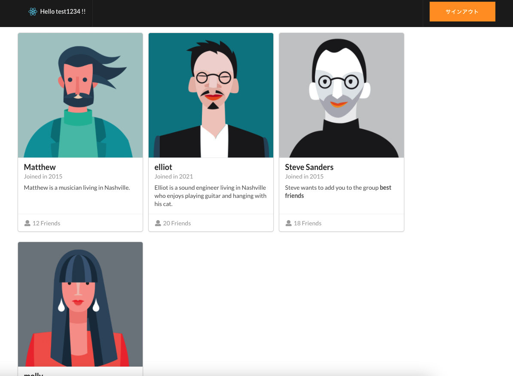

# 10. Amplifyの認証画面を修正する

## 10.1. 画面レイアウトを修正する

追加と修正を行うファイルは下図の赤枠が対象です。



ここでは，Amplifyで提供されているコンポーネントを日本語化し，ログイン後の画面を簡素ですが少しだけ変更する，という事を進めます。本当に簡易的なレイアウト追加なので付録的な内容だと思っていただければと思います。最終的には以下の画面になります。

ログイン


ログイン後


## 10.2. Amplifyの認証画面を日本語化

日本語化用のファイルを作成します。

`react-amplify/src/assets/i18n/amplify/`のフォルダを作成し，配下に`localization.js`を作成します。<br>翻訳辞書的な内容ですが，これでも全てカバー出来ないとは思いますので気休め程度に。

```javascript
// localization.js
export const localization = {
  ja: {
      'Sign In': 'サインイン',
      'Sign Up': 'サインアップ',
      'Sign Out': 'サインアウト',
      'Sign in to your account': 'アカウントにサインイン',
      'Username *': 'ユーザー名 *',
      'Password *': 'パスワード *',
      'Enter your username': 'ユーザー名を入力',
      'Enter your password': 'パスワードを入力',
      'No account?': 'アカウントが未登録ですか？',
      'Forgot your password?': 'パスワードをお忘れですか？',
      'Reset password': 'パスワードをリセット',
      'User does not exist': 'ユーザーが存在しません',
      'User already exists': 'ユーザーは既に存在します',
      'Incorrect username or password.': 'ユーザー名またはパスワードが違います',
      'Invalid password format': 'パスワードのフォーマットが不正です',
      'Create account': 'アカウントを作成',
      'Forgot Password': 'パスワードを忘れた',
      'Change Password': 'パスワードを変更',
      'New Password': '新しいパスワード',
      'Email': 'Email',
      'Phone Number': '電話番号',
      'Confirm a Code': 'コードを確認',
      'Confirm Sign In': 'サインインを確認',
      'Confirm Sign up': 'サインアップを確認',
      'Back to Sign In': 'サインインに戻る',
      'Send Code': 'コードを送信',
      'Confirm': '確認',
      'Resend Code': 'コードを再送',
      'Submit': '送信',
      'Skip': 'スキップ',
      'Verify': '検証',
      'Verify Contact': '連絡先を検証',
      'Code': 'Code',
      'Confirmation Code': '確認コード',
      'Lost your code?': 'コードがありませんか？',
      'Account recovery requires verified contact information': 'Account recovery requires verified contact information',
      'Invalid phone number format': '不正な電話番号フォーマットです。 電話番号は次のフォーマットで入力してください: +12345678900',
      'Create Account': 'アカウントを作成',
      'Have an account?': 'アカウントをお持ちですか？',
      'Sign in': 'サインイン',
      'Create a new account': '新しいアカウントを作成',
      'Reset your password': 'パスワードをリセット',
      'An account with the given email already exists.': 'そのメールアドレスは既に存在します',
      'Username cannot be empty': 'ユーザー名は必須です',
      'Password attempts exceeded': 'パスワード試行回数が超過しました',
      'Email Address *': 'メールアドレス',
      'Phone Number *': '電話番号',
      'User does not exist.': '存在しないユーザーです'
  },
};
```

日本語化の内容を適用するために`index.tsx`を修正します。

```ts
// index.tsx
import React from 'react';
import ReactDOM from 'react-dom';
import './index.css';
import App from './App';
import Amplify, { I18n } from 'aws-amplify';
import { localization } from './assets/i18n/amplify/localization';
import config from './aws-exports';
Amplify.configure(config);

I18n.putVocabularies(localization);
I18n.setLanguage('ja');

ReactDOM.render(
  <React.StrictMode>
    <App />
  </React.StrictMode>,
  document.getElementById('root')
);
```


## 10.3. ログイン後の画面レイアウトを修正

ログイン後のコンポーネントを作成します。

`react-amplify/src/layout`フォルダを作成します。このフォルダ配下に`NavBar.tsx`と`DemoContent.tsx`を追加していきます。<br>まず，`NavBar.tsx`を追加します。これは`App.tsx`で渡ってくるログインしたユーザー名を受け取りますが，この時点ではこのまま書いてもエラーが出ると思いますが，最後の`App.tsx`まで修正すると解消するので一旦は無視しましょう。

```ts
// NavBar.tsx(ログイン後のヘッダー部)
import { AmplifySignOut } from '@aws-amplify/ui-react';
import logo from '../logo.svg';
import React, { FC } from 'react';
import { Container, Menu } from 'semantic-ui-react';
import 'semantic-ui-css/semantic.min.css'

type NavProps = {
  username: string;
}

 const NavBar: FC<NavProps> = (navProps) => {
  const { username } = navProps;
  return (
    <Menu block='true' inverted>
      <Container>
        <Menu.Item header>
          
            Hello {username} !!
        </Menu.Item>
        <Menu.Item position='right'>
          <AmplifySignOut />
        </Menu.Item>
      </Container>
    </Menu>
  )
}
export default NavBar;
```

`DemoContent.tsx`を追加。あくまで飾り程度の残念コンポーネントです。こちらは何も動的な動作をしないので，特にエラーは起こりません。

```ts
// DemoContent.tsx
import { Card, Container, Icon, Image } from "semantic-ui-react";

export default function DemoContent() {
    return (
      <Container>
        <Card.Group>
          <Card>
            <Image src='https://react.semantic-ui.com/images/avatar/large/matthew.png' wrapped ui={false} />
            <Card.Content>
              <Card.Header>Matthew</Card.Header>
              <Card.Meta>
                <span className='date'>Joined in 2015</span>
              </Card.Meta>
              <Card.Description>
                Matthew is a musician living in Nashville.
              </Card.Description>
            </Card.Content>
            <Card.Content extra>
              <a href="example.com">
                <Icon name='user' />
                12 Friends
              </a>
            </Card.Content>
          </Card>
          <Card>
            <Image src='https://react.semantic-ui.com/images/avatar/large/elliot.jpg' wrapped ui={false} />
            <Card.Content>
              <Card.Header>elliot</Card.Header>
              <Card.Meta>
                <span className='date'>Joined in 2021</span>
              </Card.Meta>
              <Card.Description>
              Elliot is a sound engineer living in Nashville who enjoys playing guitar and hanging with his cat.
              </Card.Description>
            </Card.Content>
            <Card.Content extra>
              <a href="example.com">
                <Icon name='user' />
                20 Friends
              </a>
            </Card.Content>
          </Card>
          <Card>
            <Image src='https://react.semantic-ui.com/images/avatar/large/steve.jpg' wrapped ui={false} />
            <Card.Content>
              <Card.Header>Steve Sanders</Card.Header>
              <Card.Meta>
                <span className='date'>Joined in 2015</span>
              </Card.Meta>
              <Card.Description>
              Steve wants to add you to the group <strong>best friends</strong>
              </Card.Description>
            </Card.Content>
            <Card.Content extra>
              <a href="example.com">
                <Icon name='user' />
                18 Friends
              </a>
            </Card.Content>
          </Card>
          <Card>
            <Image src='https://react.semantic-ui.com/images/avatar/large/molly.png' wrapped ui={false} />
            <Card.Content>
              <Card.Header>molly</Card.Header>
              <Card.Meta>
                <span className='date'>Joined in 2019</span>
              </Card.Meta>
              <Card.Description>
                molly is a musician living in Nashville.
              </Card.Description>
            </Card.Content>
            <Card.Content extra>
              <a href="example.com">
                <Icon name='user' />
                2 Friends
              </a>
            </Card.Content>
          </Card>
        </Card.Group>
      </Container>
    )
}
```

ログイン時と非ログイン時の出し分けと，ユーザー名を`NavBar`コンポーネントに渡すくらいしかしていませんが，最後に`App.tsx`を修正します。

```ts
// App.tsx
import React, { useEffect, useState } from 'react';
import './App.css';
import {AmplifyAuthenticator } from '@aws-amplify/ui-react';
import { AuthState, onAuthUIStateChange} from "@aws-amplify/ui-components";
import NavBar from './layout/NavBar';
import DemoContent from './layout/DemoContent';

const App = () => {
  const [authState, setAuthState] = useState<AuthState>();
  const [user, setUser] = useState<any>(); 

  useEffect(() => {
    return onAuthUIStateChange((nextAuthState, authData) => {
      setAuthState(nextAuthState);
      setUser(authData);
    });
  }, []);

  return authState === AuthState.SignedIn && user ? (
    <div>
        <NavBar username={user.username}/>
        <DemoContent />
    </div>
  ) : (
      <AmplifyAuthenticator />
  );
}

export default App;
```

これでざっくりと画面レイアウトを変更出来たので，完了となります。認証機能がこれだけ簡単に実装出来るとは...という驚きが多いAmplifyでした。AmplifyコンポーネントやらAPIもかなり用意されているようですが，これを使いこなすのはなかなか骨は折れそうです。<br>これにて「mirameet vol.16」のハンズオンは終了となります。ご参加いただいた方，お疲れ様でした。