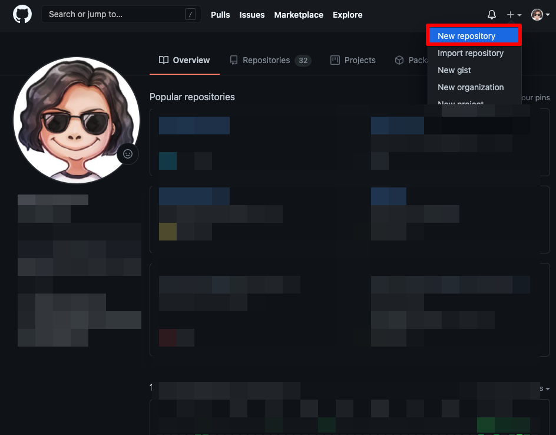
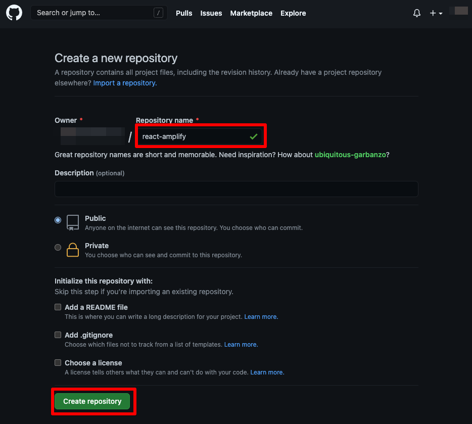
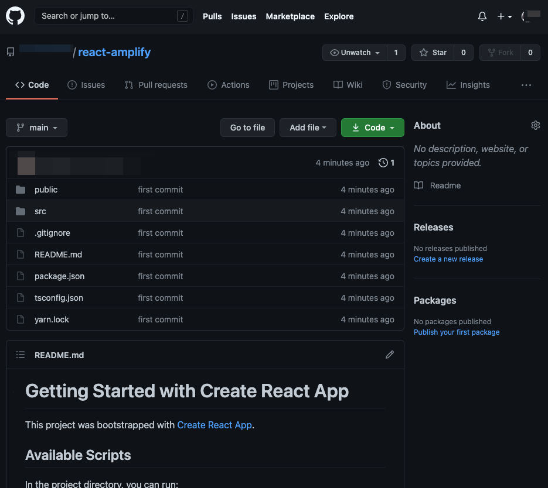

# 2. GitHubにpush

## 2.1. GitHubに新規リポジトリ作成

ご自身のGitHubアカウントへアクセスし，新しくリポジトリを作成します。



公開範囲は**public**でも**private**のどちらでもお好きな方を選択してください。



## 2.2. DockerコンテナからGitHubへプッシュ

リポジトリを作成したらコンテナ内で以下を実行します。<br>※メールアドレスとユーザー名は，GitHubのURLはご自身の環境に合わせて下さい。

```bash
git init
# ※ご自身の環境に合わせて下さい
git config --global user.email "your-mailaddress@example.com"
git config --global user.name "your name"
git add .
git commit -m "first commit"
git branch -M main
# ※ご自身の環境に合わせて下さい
git remote add origin https://github.com/{your name}/react-amplify.git
git push -u origin main
```

以下の通り，反映されていればOKです。



ここまで完了したらAWSコンソールからAmplifyを使用してデプロイします。
