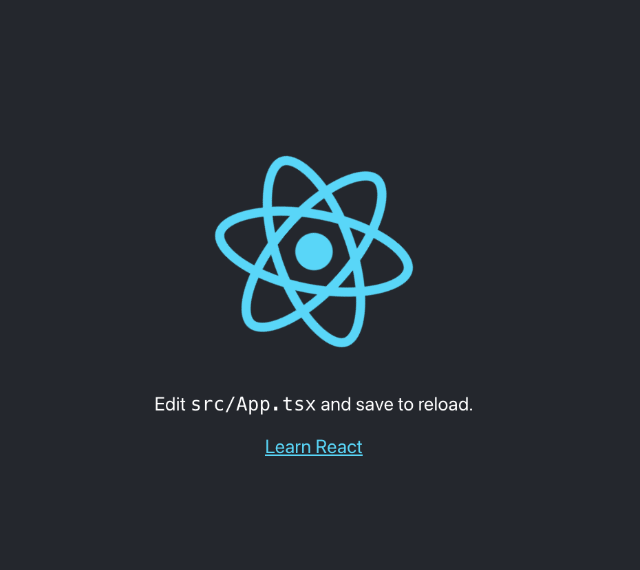

# 1. Reactアプリ作成

## 1.1. create-react-appでReact x Typescript環境構築

早速作成していきます。

```sh
$ npx create-react-app react-amplify --template typescript
```

しばらく時間がかかるので少し待ちましょう。

## 1.2. Reactアプリの動作確認

`Happy hacking!`とコンソールに表示されたらReactアプリの起動を確認します。

```
$ cd react-amplify
$ yarn start
```

以下の通り，画面が表示されたらOKです。



次はGitHubへリポジトリを作成し，ここまでの内容をプッシュしていきます。