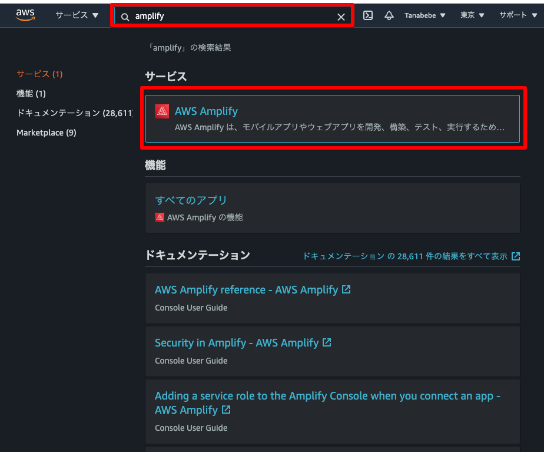
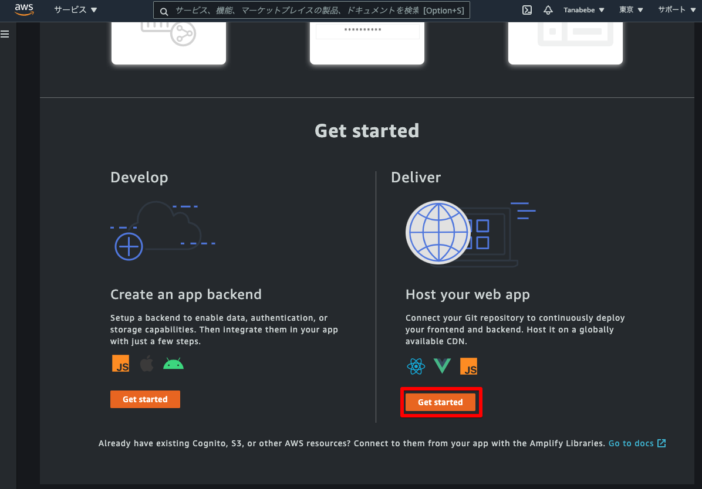
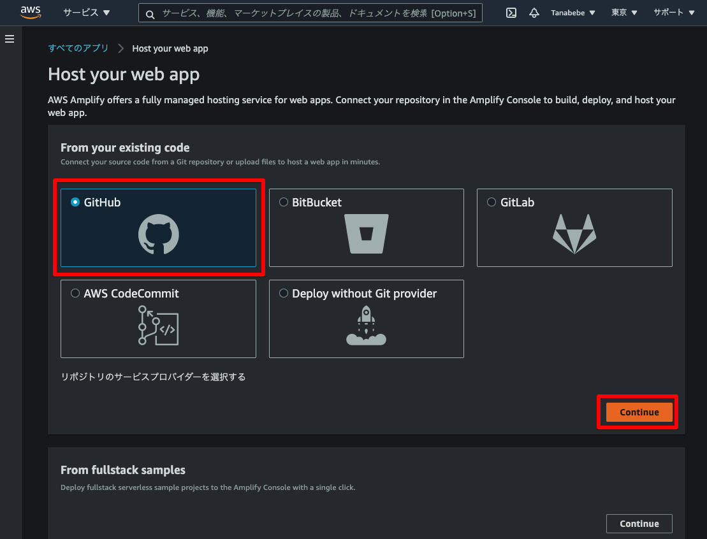
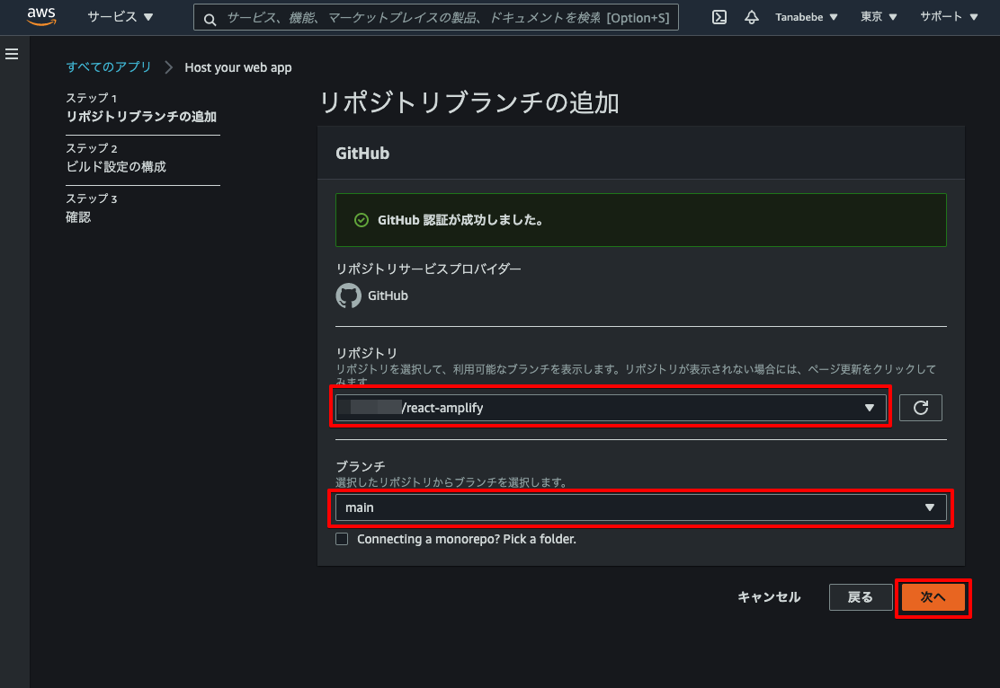
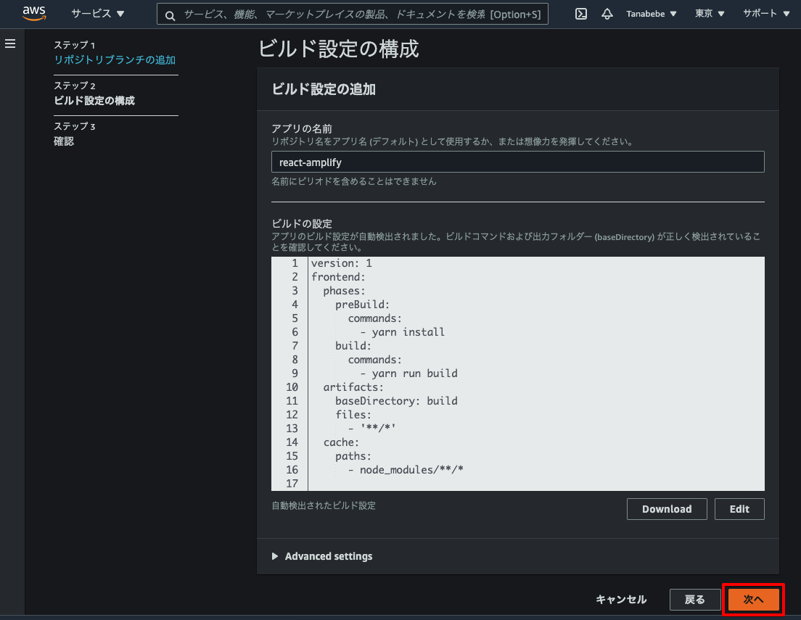
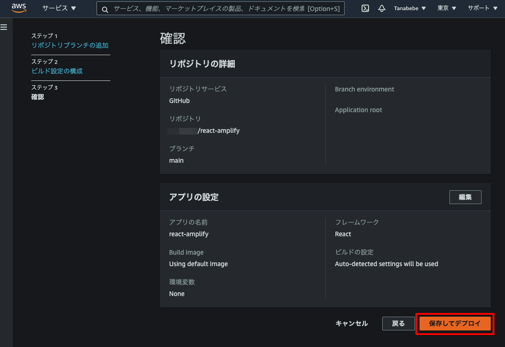
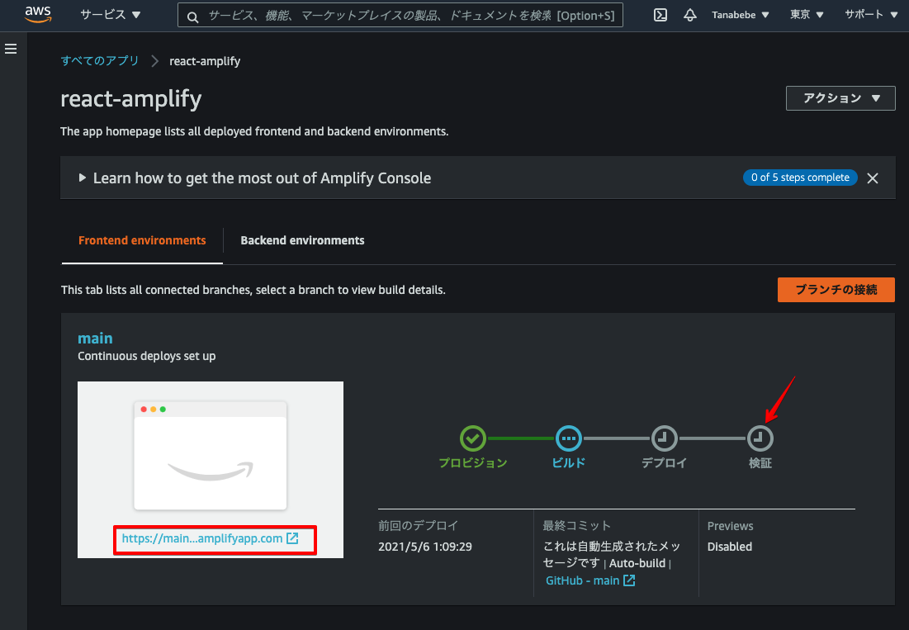

# 3. Amplifyでデプロイ

AWSコンソールにサインインし，Amplifyサービスを検索，選択します。

## 3.1. Amplifyサービスの選択

Amplifyのサービス画面に移動したらページ下部のDeliverのGet startedを選択します。

## 3.2. AmplifyとGitHubの連携

GitHubを選択し，次へ進みます。

GitHubの認証が必要なので完了させると以下のとおり，リポジトリと連携出来るようになります。 前項で作成したリポジトリの`react-amplify`を選択し，**次へ**を選択します。

## 3.3. Amplifyの自動ビルド設定とデプロイ

ビルド設定の構成ではデフォルトのまま，**次へ**を選択します。

確認まで進んだら**保存してデプロイ**を選択します。

Amplifyによって自動でビルドされ、アプリが公開されますが**検証**まで完了するのは少し時間がかかります。下図の赤枠部から公開されたページに飛べます。

## 3.4. デプロイされたReactアプリの確認

検証まで完了すると下図と同じ画面が表示されます（完了していない場合はデフォルトの画面が表示されます）。

次はReactのコードを変更して，自動デプロイの確認をします。