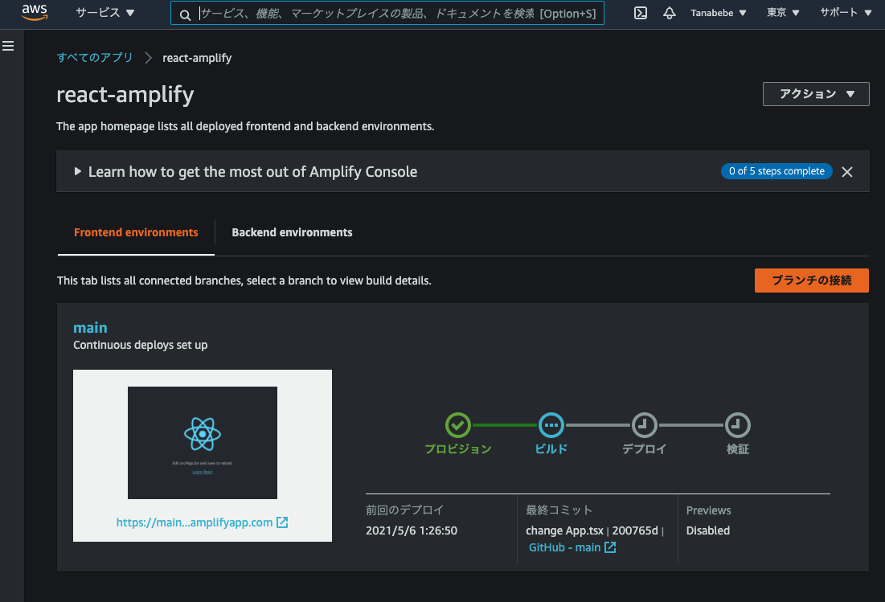

# 4. 自動デプロイ(CI/CD)の確認

## 4.1. プログラムの修正

`react-amplify/src/App.tsx`ファイルを修正して自動デプロイが有効になっているかを確認していきます。プログラムを下記の通り，VS Code上で修正します。

```jsx
import React from 'react';
import logo from './logo.svg';
import './App.css';

function App() {
  return (
    <div className="App">
      <header className="App-header">
        
        <p>
          Hello Amplify!!
        </p>
      </header>
    </div>
  );
}

export default App;
```

## 4.2. Amplifyの自動デプロイ確認

変更したらプッシュします。

```sh
git add src/App.tsx
git commit -m "change App.tsx"
git push
```

プッシュしたらAWSコンソールへ行き，確認します。mainブランチのプッシュを検知して自動デプロイがトリガーされているのがわかります。



修正箇所が反映されているのを確認出来たらOKです。


次はAmplifyの設定を進めていきます。