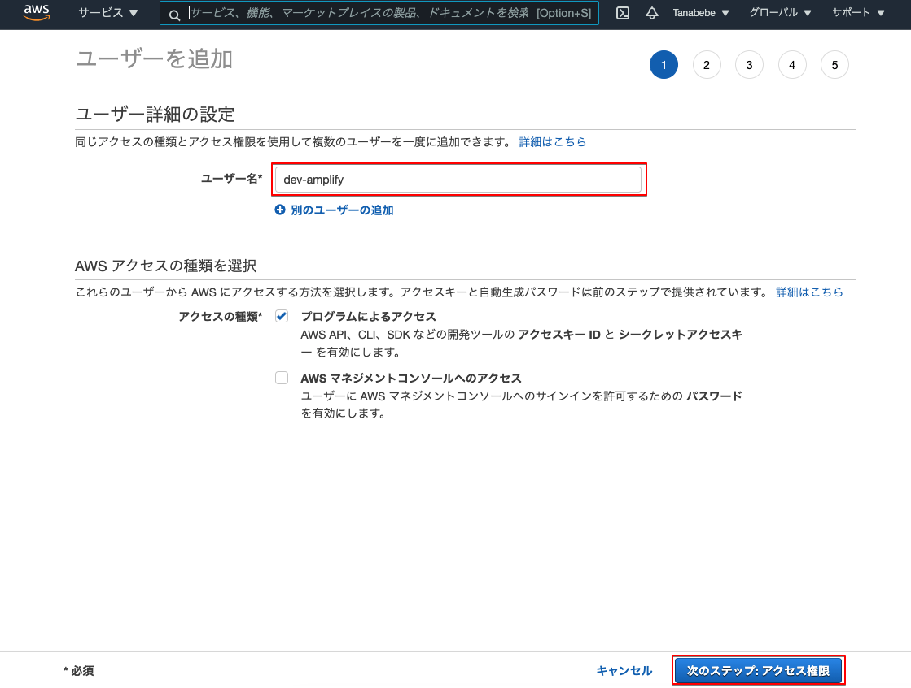
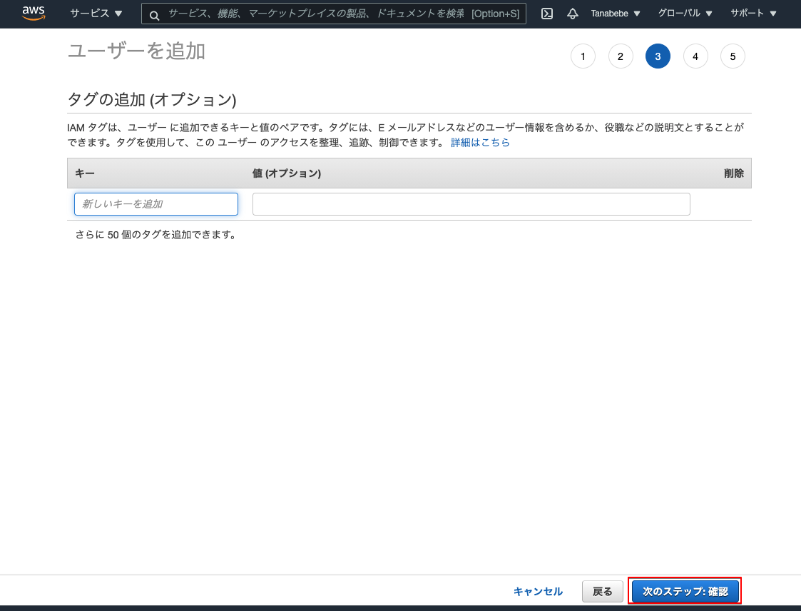

# 4. Amplifyのユーザー作成

## 4.1. Amplifyプロジェクトを操作するアカウントの設定

Dockerコンテナに入った状態で実施していきます。Amplifyの設定をしますが以下コマンド実行後は設問となるので注意して下さい。

```bash
# まずはこのコマンドを実行する
amplify configure
```

以降ターミナル上で設問が始まるので注意。以降は設問毎に表題を分割しています。

```bash
# amplify configureのコマンド実行直後
Initializing new Amplify CLI version...
Done initializing new version.
Scanning for plugins...
Plugin scan successful
Follow these steps to set up access to your AWS account:

Sign in to your AWS administrator account:
https://console.aws.amazon.com/
Press Enter to continue # ここはEnterを押してOKです
```

### 4.2. リージョンの選択
```bash
Specify the AWS Region
# ap-northeast-1を選択し，Enter
? region:  ap-northeast-1
```

### 4.3. IAMユーザー名の入力

```bash
Specify the username of the new IAM user:
# dev-amplifyと入力し，Enter
? user name:  dev-amplify
```

### 4.4. AWSコンソール上でユーザーの確認
```bash
Complete the user creation using the AWS console
https://console.aws.amazon.com/iam/home?region=ap-northeast-1#/users$new?step=final&accessKey&userNames=dev-amplify&permissionType=policies&policies=arn:aws:iam::aws:policy%2FAdministratorAccess
# ご自身のURLが表示されるのでユーザの確認をします（下図を参照）
```

URLにアクセスすると下図の画面が表示されますので，ユーザー名を確認して次へ。



既存ポリシーはそのままで次へ。


タグは得に設定せず次へ（設定したい方は設定しても可です）。


ユーザー名，アクセス権限，タグの確認を行いユーザーの作成を選択します。


ユーザーが追加されるのでアクセスキーID，シークレットアクセスキーをコピーし，控えておいて下さい。<br>csvのダウンロードでも可です。


### 4.5. アクセスキー情報の入力
```bash
Press Enter to continue　# ←Enterを押してキー情報入力
Enter the access key of the newly created user:
# 前項で控えたアクセスキーIDをコピペしてEnter
? accessKeyId:  ********************
# 前項で控えたシークレットアクセスキーをコピペしてEnter
? secretAccessKey:  ****************************************
```

### 5.6. プロファイル名の選択
```bash
This would update/create the AWS Profile in your local machine
# デフォルトを選択しEnter
? Profile Name:  default
# 完了すると表示される
Successfully set up the new user.
```

これでawsフォルダ配下にIAMユーザーのプロファイルが生成されます。 次はAmplifyプロジェクトの作成を行います。