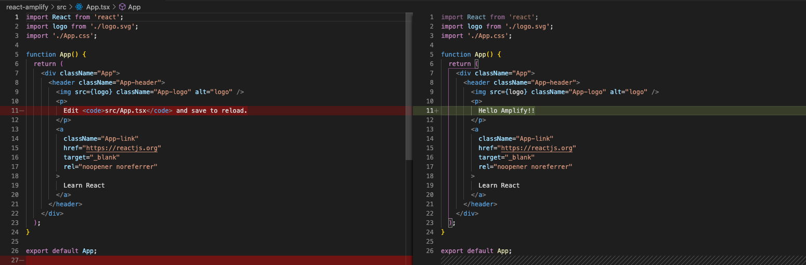

# 5. 自動デプロイの確認

`react-amplify/src/App.tsx`ファイルを修正します。軽微な修正なので下図の通り，修正します。



コードは以下です。

```jsx
import React from 'react';
import logo from './logo.svg';
import './App.css';

function App() {
  return (
    <div className="App">
      <header className="App-header">
        
        <p>
          Hello Amplify!!
        </p>
        <a
          className="App-link"
          href="https://reactjs.org"
          target="_blank"
          rel="noopener noreferrer"
        >
          Learn React
        </a>
      </header>
    </div>
  );
}

export default App;
```

変更したらプッシュします。

```
$ git add src/App.tsx
$ git commit -m "change App.tsx"
$ git push
```

プッシュしたらAWSコンソールへ行き，確認します。mainブランチのプッシュを検知して自動デプロイがトリガーされているのがわかります。


修正箇所が反映されているのを確認出来たらOKです。


次はAmplifyの設定を進めていきます。