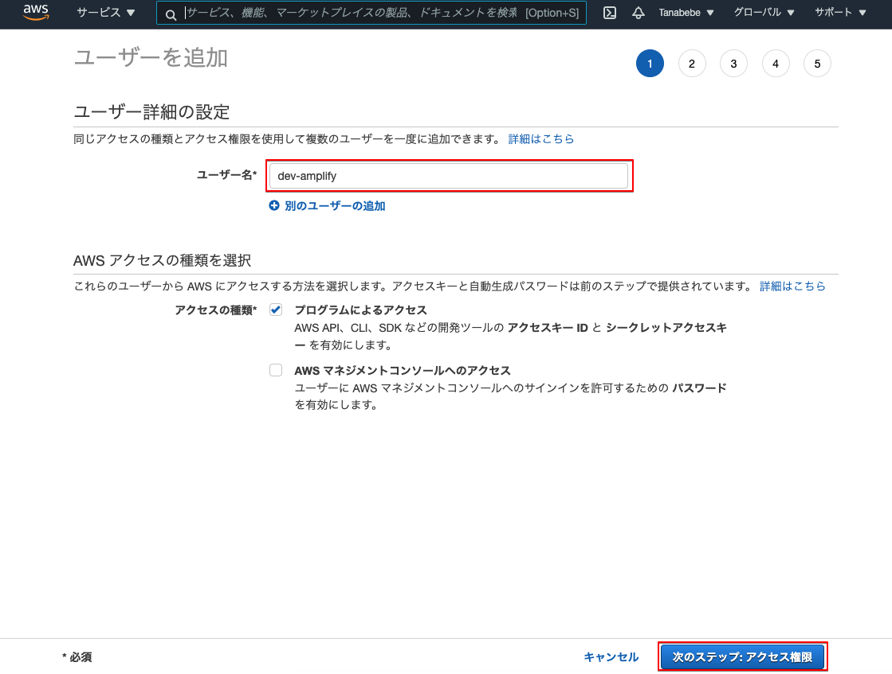
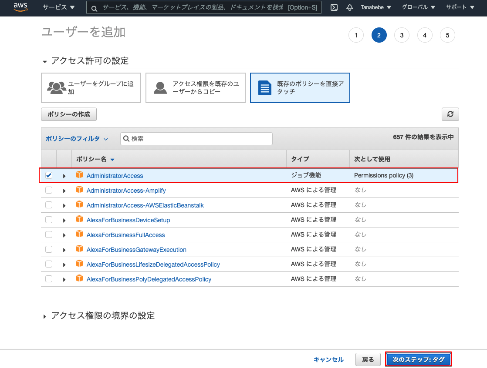
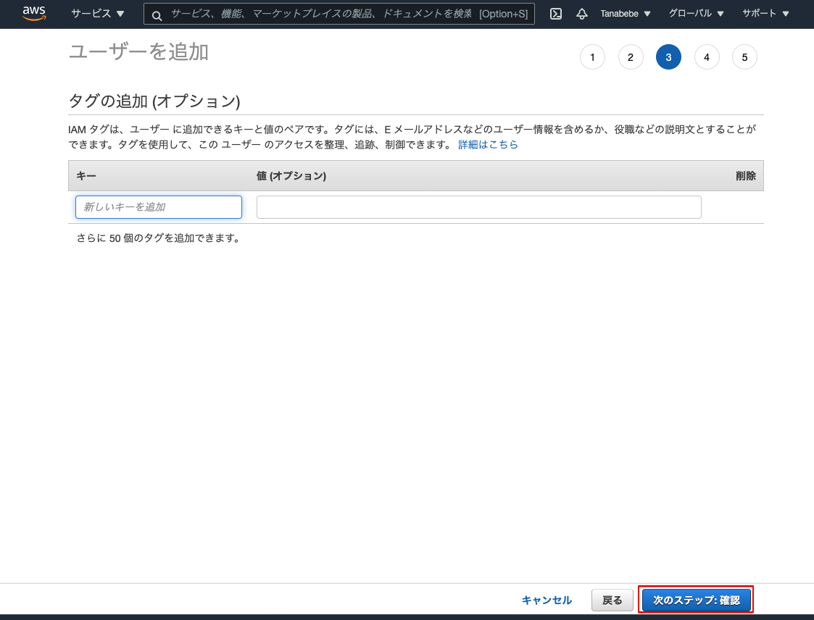
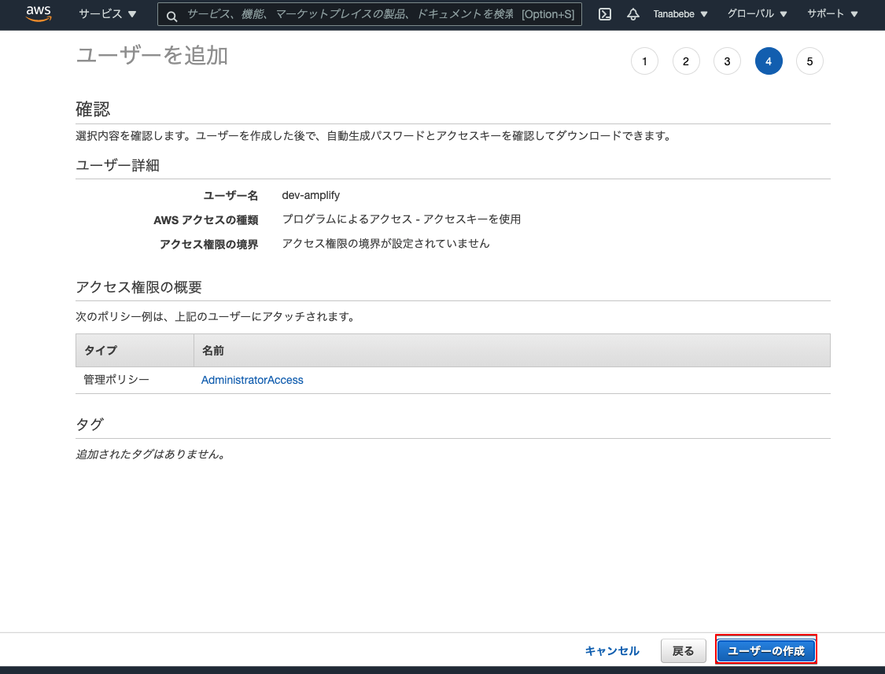
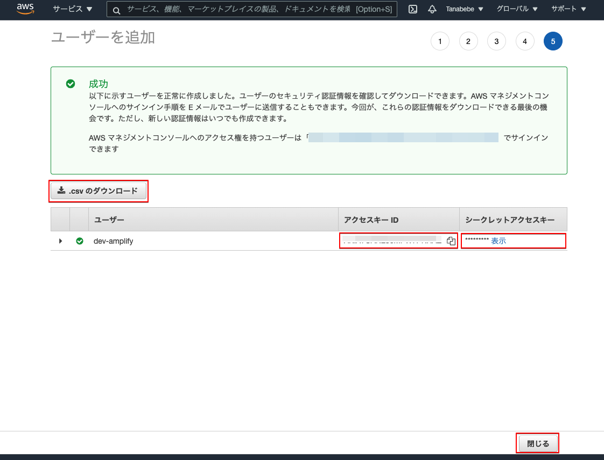

# 6. Amplifyのユーザー作成

Dockerコンテナに入った状態で実施していきます。amplifyの設定をしますが以下コマンド実行後は設問となるので注意して下さい。

```sh
$ amplify configure
Initializing new Amplify CLI version...
Done initializing new version.
Scanning for plugins...
Plugin scan successful
Follow these steps to set up access to your AWS account:

Sign in to your AWS administrator account:
https://console.aws.amazon.com/
Press Enter to continue
# Enterを押してOKです
Specify the AWS Region
# 以下を選択しましょう
? region:  ap-northeast-1
Specify the username of the new IAM user:
# dev-amplifyとします
? user name:  dev-amplify
Complete the user creation using the AWS console
https://console.aws.amazon.com/iam/home?region=ap-northeast-1#/users$new?step=final&accessKey&userNames=dev-amplify&permissionType=policies&policies=arn:aws:iam::aws:policy%2FAdministratorAccess
Press Enter to continue
# 上記URLにアクセスしてユーザの確認をします（下図を参照）
Enter the access key of the newly created user:
# 画像内のアクセスキーIDをコピペします
? accessKeyId:  ********************
# 画像内のシークレットアクセスキーをコピペします
? secretAccessKey:  ****************************************
This would update/create the AWS Profile in your local machine
# デフォルトを選択します
? Profile Name:  default

Successfully set up the new user.
```

これでawsフォルダ配下にIAMのプロファイルが生成されます。

コンソール内のURLにアクセスすると以下の画面が表示されますので，ユーザー名を確認して次へ。


既存ポリシーはそのままで次へ。


タグは得に設定せず次へ（設定したい方は設定しても可です）。


ユーザー名，アクセス権限，タグの確認を行いユーザーの作成を選択します。


ユーザーが追加されるのでアクセスキーID，シークレットアクセスキーを控えて下さい。<br>csvのダウンロードでも可です。
