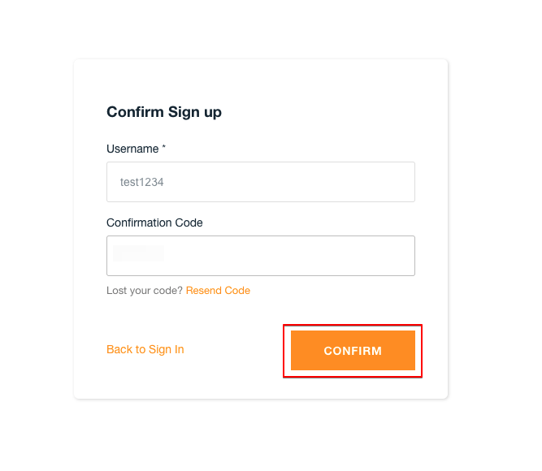
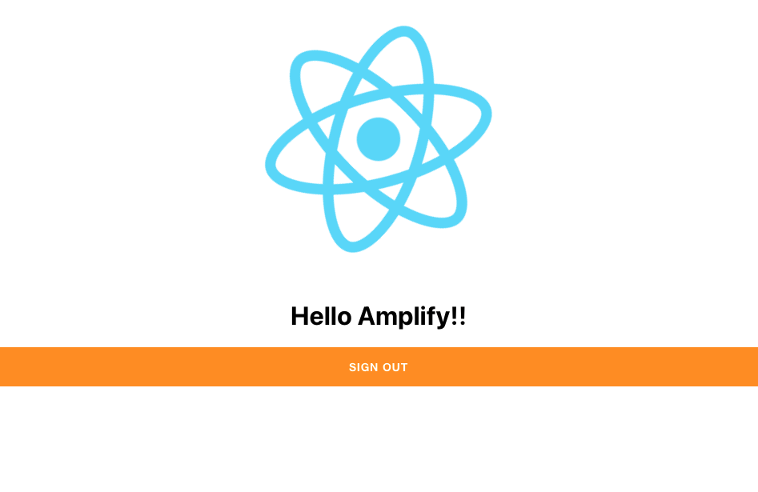

# 8. Reactアプリに認証機能を追加する

## 8.1. ReactアプリにAmplifyのAWSリソースを追加

`react-amplify/src/index.tsx`を修正する。

```ts
// index.tsx
import React from 'react';
import ReactDOM from 'react-dom';
import './index.css';
import App from './App';
import Amplify from 'aws-amplify';
import config from './aws-exports';
Amplify.configure(config);

ReactDOM.render(
  <React.StrictMode>
    <App />
  </React.StrictMode>,
  document.getElementById('root')
);
```

## 8.2. 認証用コンポーネントの追加

`react-amplify/src/App.tsx`を修正する。

```ts
import logo from './logo.svg';
import './App.css';
import { withAuthenticator, AmplifySignOut } from '@aws-amplify/ui-react'

function App() {
  return (
    <div className="App">
      <header>
        
        <h1>Hello Amplify!!</h1>
      </header>
      <AmplifySignOut />
    </div>
  );
}

export default withAuthenticator(App);
```

## 8.4. 認証画面の動作確認とログインユーザー作成

ここまで修正したら`yarn start`で起動しましょう。`http://localhost:3000/`でアクセスすると以下の画面が表示されます。画面内の**Create account**からアカウントを作成します。


アカウントの作成画面に移動するので，作成します。次の画面で確認コードを入力する必要があるので，**有効なメールアドレス**を入力して下さい。




送られてきたメールの確認コードを入力するとログイン出来ます。



この時点での成果をプッシュしていき，自動デプロイの結果も確認したいところですが，AWSコンソール上でAmplifyの設定を更新する箇所がありますので次項で進めます。